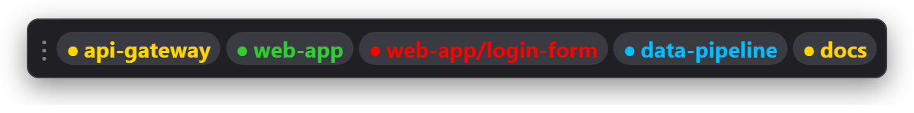
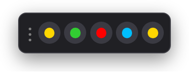

<p align="center">
  
</p>

<h1 align="center">lollipop</h1>

<p align="center">
  A traffic light for your AI coding agents, in <b>Orca</b> and in plain <b>Claude Code</b> sessions: a small
  always-on-top window that tells you, at a glance, which agent is working, which one is done and which one is
  waiting for you.
</p>

<p align="center">
  
</p>

<p align="center"><a href="README.it.md">Leggi in italiano</a></p>

The name comes from the British *lollipop man*: the crossing guard with the round sign who tells each person
when it's their turn.

## Features

- **One entry per agent**: every Orca agent with an open terminal and every Claude Code session running on this
  machine (console, Windows Terminal, Warp, the VS Code or IntelliJ terminal, ...), colored by state:

  | Color | State |
  |---|---|
  | 🟡 yellow | working (`working`) |
  | 🟢 green | done (`done`) |
  | 🔵 blue | turn finished, but background shells or monitors are still running (Orca only) |
  | 🔴 red | waiting for you: input or a permission (`waiting`, `blocked`) |

- **Blinks** when an agent has just finished and you haven't looked at it yet. It stops when you click the entry,
  bring the agent to the front, or the agent starts working again. If you were already looking at the agent, it
  doesn't blink.
- **Click an entry** to bring the agent to the front: Orca right on that agent's terminal, or the window hosting
  the Claude Code session, which lollipop finds by itself. See [Claude Code sessions](#claude-code-sessions).
- **Tray icon** in the color of the most urgent agent, with a summary in its tooltip
  (`lollipop — 1 waiting, 1 done, 2 working`). With no agents the window disappears and only the icon stays; you
  can also hide the window for good and keep only the icon.
- **Stays out of the way**: grows to the left keeping its right edge fixed, stays above the taskbar, works across
  multiple monitors and remembers where you left it.

<p align="center">
  
  &nbsp;&nbsp;&nbsp;&nbsp;
  
</p>
<p align="center"><sub>Compact view and tray icons</sub></p>

> The UI is in English or Italian, following the OS language; you can switch it from the menu.

## Requirements

- **Windows 10/11** with WebView2 (preinstalled on Windows 11 and on up-to-date Windows 10).
- At least one of:
  - **Orca** running on the same machine (tested with Orca 1.4.211);
  - **Claude Code** CLI (tested with 2.1.282), with the lollipop hook installed from the menu.
- **macOS 11+**: experimental, see [Limitations](#limitations).

## Install

### Download

Get the latest build from [Releases](https://github.com/antoniointrieri/lollipop/releases), or the build of any
commit from the [Actions](https://github.com/antoniointrieri/lollipop/actions) page.

- **Windows**: `lollipop.exe`. The executable isn't signed, so the first time SmartScreen may say "Windows
  protected your PC": click *More info* → *Run anyway*.
- **macOS**: `lollipop-macos.tar.gz` (universal binary, Apple Silicon and Intel). It isn't signed either, so
  remove the quarantine flag before running it:

  ```sh
  tar -xzf lollipop-macos.tar.gz
  xattr -d com.apple.quarantine lollipop
  ./lollipop
  ```

Some antivirus products, Microsoft Defender included, may flag the unsigned `lollipop.exe` with a generic
machine-learning detection (for example `Trojan:Win32/Wacatac.B!ml`). To check that a Release binary was built by
this repository's CI from the tagged commit, verify its provenance attestation with the
[GitHub CLI](https://cli.github.com/):

```sh
gh attestation verify lollipop.exe --repo antoniointrieri/lollipop
```

### Build from source

Requires **Go 1.26** or later. No Node or npm needed.

```sh
git clone https://github.com/antoniointrieri/lollipop.git
cd lollipop
go build -ldflags "-H=windowsgui" -o lollipop.exe .   # Windows
go build -o lollipop .                               # macOS (needs the Xcode Command Line Tools)
```

To start it at login, tick **Start at login** in the menu.

## Usage

| Action | Effect |
|---|---|
| Click an entry | brings the agent to the front (Orca on its terminal, or the Claude Code window) |
| Drag the `⋮` handle | moves the window |
| Right-click (window or tray icon) | settings menu and **Quit** |
| Click the tray icon | shows the window (when there are agents) and brings it to the front |

Settings, available from the menu, apply immediately and are saved:

- **Shape**: rectangle or pill
- **Indicator**: dot or lollipop (the tray icon's head with its white spiral)
- **Blinking**: slow, normal or fast
- **Size**: small, normal or large
- **Compact**: dots only, with the name in the tooltip
- **Always on top** and **Show window**
- **Start at login**: a per-user `Run` registry entry on Windows, a LaunchAgent on macOS
- **Claude Code**: integration status, **Install** (then **Repair**), **Remove integration**
- **Language / Lingua**: automatic (OS language), English or Italiano

Settings and window position are stored in `settings.json` inside `%APPDATA%\lollipop` (Windows) or
`~/Library/Application Support/lollipop` (macOS). Alt+F4 hides the window instead of closing the app: use
**Quit**.

### Claude Code sessions

On first start lollipop offers to add a hook to your Claude Code user settings (`~/.claude/settings.json`, with
a backup). The hook runs `lollipop.exe hook` in the background on every Claude Code event: Claude never waits
for it. Sessions running inside Orca are skipped, since Orca already shows them.

The **Claude Code** submenu shows whether the integration is active and lets you repair or remove it. Removing
it only touches lollipop's own entries; if you delete the exe without removing it, the leftover entries do
nothing. If you move the exe, lollipop fixes the path on its next start.

Clicking an entry brings the right window to the front, not the exact tab: Windows Terminal and IDEs don't let
other apps select a tab or a terminal panel. Sessions inside WSL, SSH or containers show their state, but
clicking them does nothing.

### Troubleshooting

A red dot with "Error" in the tooltip means Orca answered in an unexpected way (for example after an Orca
update); lollipop keeps retrying every half second. A closed Orca is not an error. To see what it reads from Orca and Claude Code:

```sh
lollipop.exe -once | more     # Windows
./lollipop -once              # macOS
```

It prints agents, states and the active pane, then exits.

## How it works

**Orca**: lollipop talks to Orca's local runtime through the same named pipe the `orca` CLI uses (a Unix socket on macOS),
reading the address and token from `orca-runtime.json` in Orca's data folder. Every 500 ms it asks Orca for the
worktrees with their agents and for the list of terminals; on click it asks Orca to focus the terminal. It
changes nothing else in Orca, and the token is never written anywhere.

> [!WARNING]
> The pipe protocol is **undocumented**: it was worked out by observing Orca. An Orca update could break it; if
> that happens, lollipop shows the red dot with the error.

**Claude Code**: the hook writes one small state file per session in lollipop's settings folder, and lollipop
reads that folder every 500 ms. The hook also records which window hosts the session, walking up from the Claude
Code process; a session whose process is gone is dropped.

The UI is built with [Wails v3](https://github.com/wailsapp/wails): a Go backend and an HTML page embedded in the
binary.

## Limitations

- **macOS is untested**: `platform_darwin.go` is written from Orca's source and compiles in CI, but it has never
  been run. The Orca data folder (`~/Library/Application Support/orca`) and the socket transport are educated
  guesses. If you have a Mac, run `./lollipop -once` and report what happens.
- Claude Code sessions: clicking brings the right window to the front, not the exact tab or IDE panel. With
  several windows of the same terminal, the one with the session folder in its title wins, otherwise the first.
  Sessions inside WSL, SSH or containers show their state, but clicking them does nothing.
- If you split Orca tabs into several side-by-side groups, active-pane detection only looks at the main group.
- Only local terminals are shown, not those of remote hosts.
- Wails v3 is still in beta: the version is pinned in `go.mod`.

## Development

```
main.go               startup, polling loop, Go <-> frontend events
orca.go               client for Orca's runtime
claude.go             plain Claude Code sessions: hook, session files, settings.json install
state.go              entries, blinking, tray summary (pure logic, tested)
ui.go                 settings, menus, tray, window position, icon drawing
platform_*.go         Windows- and macOS-specific code
frontend/index.html   the window (HTML/CSS/JS, no build step)
docs/spec.md          specification: behavior and decisions (Italian)
```

- Tests: `go test ./...`
- Notable changes go in [CHANGELOG.md](CHANGELOG.md); the section of a version becomes its Release notes.
- CI (`.github/workflows/build.yml`) tests and builds Windows and macOS on every push; pushing a `v*` tag also
  publishes a GitHub Release with both binaries and a build provenance attestation for them.
- The executable icon (`lollipop.ico`, `rsrc_windows_amd64.syso`) is drawn by the code in `ui.go`. If you change
  the drawing, regenerate it with `go generate`. The same `.syso` holds the manifest and the version info, which
  CI regenerates from the git tag on every build.

## License

[MIT](LICENSE)
